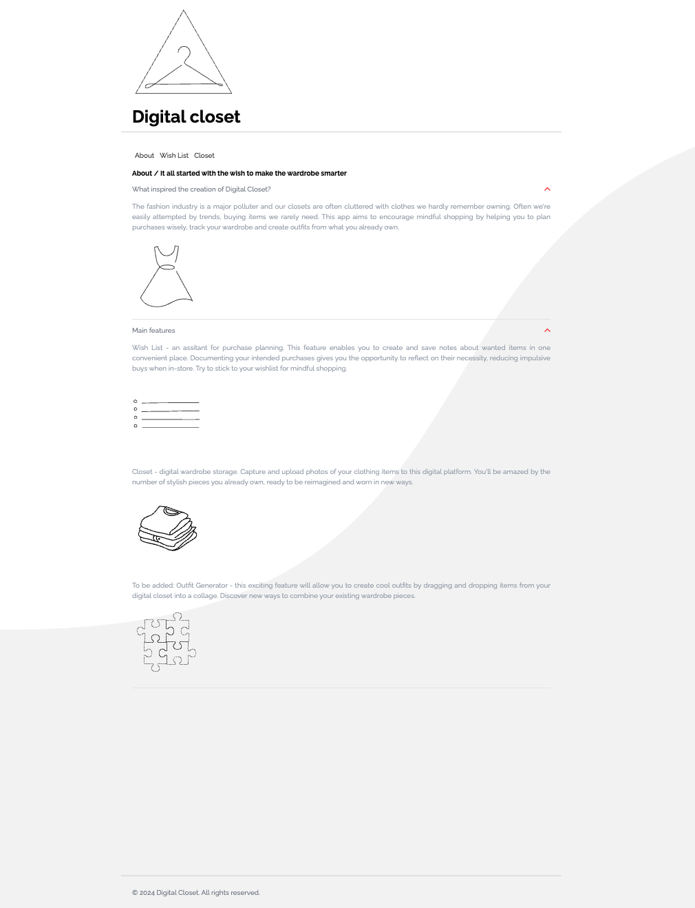

# Digital Closet △

An application designed to assist in making thoughtful and sustainable wardrobe choices. This project is written using TypeScript and Vue 3 Composition API.

### App can be checked here:

https://belkaite.github.io/digital-closet/



## Main features

#### Wish List:

A CRUD (Create, Read, Update, Delete) feature that acts as a purchase planner. Users can add purchases with key details (name, price, link), mark items as purchased and monitor their spendings and savings.

#### Closet:

A digital wardrobe where users can upload clothing items from their devices and view them instantly on the page. Firebase is used for storage. **Note**: to follow best practices for security, Firebase API keys and other configuration details are hidden, which means the demonstration of the feature could be done during reviews.

## Future improvements

Planned functionalities include:

#### Link Preview:

Intended for the Wish List section to display a preview of links added next to items. Attempts to implement this with '@ashwamegh/vue-link-preview' faced performance issues without a server (loading takes really long sometimes). This feature is omitted for now, as my current knowledge is limited to front-end development basics.

#### Outfit Generator:

A tool to create digital outfit collages by dragging and dropping uploaded images into a four-block grid (to mimic a an outfit collage). Unfortunately, due to time constraints, I was not able to implement this feature right now. I was considering to use such libraries as 'Vue Draggable' or 'HTML Drag and Drop API'.

## Technical dependecies used for this project

- TypeScript
- Vue Router
- Pinia for state management
- Vitest unit testing
- Playwright for end-to-end testing
- ESLint, StyleLint, Prettier
- Firebase
- Mix of Tailwind and plain css for styling


## Project Setup
```sh
npm install
```
#### Start Dev Server
```sh
npm run dev
```
#### Build for Release
```sh
npm run build
```
#### Run Unit Tests with Vitest
```sh
npm run test:unit
```
#### Run End-to-End Tests with Playwright
```sh
npm run test:e2e
```
#### Lint with ESLint
```sh
npm run lint
```
